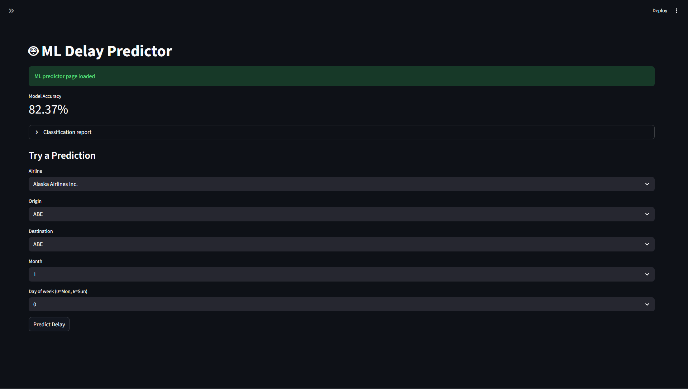

# ✈️ Flight Delay Analysis & Prediction


> An end-to-end data analytics project built with Python, Streamlit, and machine learning to explore flight delays, identify patterns, and predict whether a flight is likely to be delayed.
 

.png)
.png)


<p align="center"
  
</p>

<p align="center">
  
</p>

<p align="center">
  
</p>
---

## 🌟 Project Highlights

* **Data loading** from a large flight dataset
* **Cleaning** to remove noise and handle missing values
* **Feature engineering** for time, route, and delay-related variables
* **Exploratory data analysis (EDA)** for airlines, airports, routes, and delay causes
* **Interactive Streamlit dashboard** with multiple views
* **Machine learning predictor** for delay risk estimation

---

## 🛠️ Tools Used

| Area             | Tools                       |
| ---------------- | --------------------------- |
| Programming      | Python                      |
| Data Handling    | Pandas, NumPy               |
| Visualization    | Matplotlib, Seaborn, Plotly |
| Dashboard        | Streamlit                   |
| Machine Learning | Scikit-learn                |
| Notebook Work    | Jupyter / `.ipynb`          |
| Development      | VS Code                     |

---

## 📁 Project Structure

```text
flight_delay_project/
├── data/
│   ├── raw/
│   └── processed/
├── notebooks/
├── dashboard/
│   ├── app.py
│   ├── data_loader.py
│   ├── ui.py
│   └── pages/
├── src/
├── outputs/
├── requirements.txt
└── README.md
```

---

## 📊 What the Project Explores

### 1) Time Patterns

* Delay rate by month
* Delay rate by day of week
* Weekend vs weekday behavior

### 2) Airline Analysis

* Average arrival delay by airline
* Delay probability by airline
* Airline performance comparison

### 3) Airport Analysis

* Airports with the highest average delays
* Airports with the highest delay probability
* Traffic vs delay risk

### 4) Route Analysis

* Worst origin-destination routes
* Route-level delay probability
* Fragile routes with high disruption

### 5) Delay Cause Analysis

* Carrier delay
* Weather delay
* NAS delay
* Security delay
* Late aircraft delay

### 6) Prediction

* Predict whether a flight is likely to be delayed
* Use airline, origin, destination, month, and weekday features

---

## 🔍 Key Insights

* Delay rates peak in the summer months.
* Low-cost carriers often show higher delay risk.
* Delay causes are mostly operational rather than security-related.
* Departure delays strongly propagate into arrival delays.
* Certain routes and airports are consistently more fragile than others.

---

## 🚀 How to Run

### 1. Install dependencies

```bash
pip install -r requirements.txt
```

### 2. Run the dashboard

```bash
streamlit run dashboard/app.py
```

---

## 📌 Notes

* The project uses a cleaned and feature-engineered version of the raw flight dataset.
* The dashboard is designed to work in both light mode and dark mode.
* Page names in Streamlit come from the filenames inside `dashboard/pages/`.

---

## 📝 Streamlit Page Naming Tip

If you want the sidebar page names to appear with capital letters, rename the files like this:

```text
dashboard/pages/
├── 1_Overview.py
├── 2_Airline_Analysis.py
├── 3_Airport_Analysis.py
├── 4_Route_Analysis.py
├── 5_Delay_Causes.py
├── 6_ML_Predictor.py
```

Streamlit displays the page names based on the filename, so using capitalized filenames gives cleaner sidebar labels.

---

## 🎯 Project Goal

Build a polished analytics product that answers:

* When do flight delays happen?
* Which airlines and airports are most affected?
* What causes most delays?
* Can we predict delay risk before the flight?

---

## 👤 Portfolio Summary

This project demonstrates:

* Data cleaning on a real-world dataset
* Feature engineering
* Business-focused analysis
* Dashboard creation
* Basic machine learning for prediction

---

## ✨ Future Improvements

* Add map visualizations for airports
* Improve the ML model with more features
* Add model explainability
* Add filters for date ranges and routes
* Publish the dashboard online
